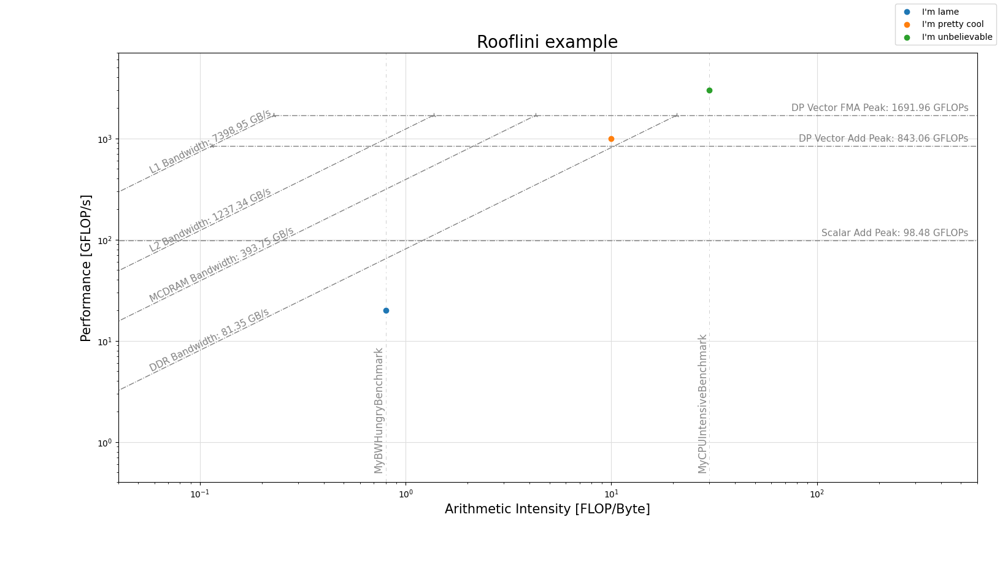

# Rooflini
Do you want to draw an Intel Advisor style Roofline Analysis plot?

This is a Python script which lets you freely set:
- roofs and upper bounds (with labels);
- data points;
- plot figure aspect and ratio.

Try it out and make it your own.

Regards,
giopaglia
